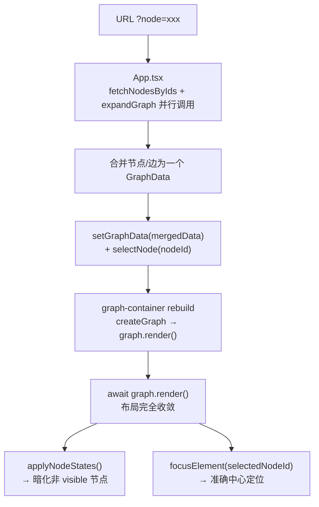

## 产品概述

修复 DeepScope 图谱组件的 4 个渲染相关问题。

## 核心功能

1. **显示设置切换导致节点着色丢失**：点工具栏齿轮切换任意开关后，所有节点的 category 着色变成默认灰色
2. **首屏分两段渲染**：通过 `?node=xxx` 访问时，先渲染单节点，300ms 后再渲染展开的邻居，视觉上闪两次
3. **首屏未暗化非高亮节点**：首屏加载后所有节点全亮，需手动重新点击节点才触发 dimm
4. **首屏中心定位不准确**：首屏加载后选中节点不在画布中心，再次点击节点后才准确聚焦

## 技术栈

- React 18 + TypeScript
- AntV G6 v5（图谱可视化）
- Zustand（状态管理）
- axios + TanStack Query

## 实施方法

### 问题 1：显示设置 setNode 覆盖 fill 着色

**根因**：`graph-container.tsx` 第531-568行的 `displaySettings` useEffect 中，`graph.setNode({ style: { labelText: ... } })` 会**替换** G6 节点样式配置，导致 `createGraph()` 中定义的 `fill: (d) => categoryColorMapRef.current.get(cat)` 回调丢失。

**修复**：在 `graph.setNode()` 的 `style` 中同时传入 `fill` 回调，与 `createGraph()` 中的逻辑保持一致，引用同一个 `categoryColorMapRef`。

### 问题 2：首屏 node + expand 分两段渲染

**根因**：`App.tsx` 第179-198行的 `?node` 流程中，`fetchNodesByIds` → `setGraphData(data)`（触发全量重建）→ 300ms后 `selectNode` + `bfsExpandNode`（触发增量渲染），共触发两次渲染。

**修复**：将 node 查询和 expand 查询改为**并行请求**，拿到两份数据后手动合并为一个 `GraphData`，再一次性调用 `setGraphData`。具体做法：在 App.tsx 的 `?node` 分支中，直接调用 `expandGraph` API（不走 store action），合并节点/边后统一 setGraphData，同时直接设置 `selectedNodeId`。

### 问题 3 + 4：首屏暗化 + 中心定位

**根因**：

- `setGraphData` 重置 `selectedNodeId: null`，graph 重建后首次渲染时无选中状态、无暗化
- 300ms 后 `selectNode` 触发暗化 effect，但 graph 此时可能未就绪（d3-force 布局异步执行）
- 首屏重建后无显式 `focusElement` 调用，布局未收敛时聚焦位置不准

**修复方案**：

- 在 `createGraph()` 中使用 `await graph.render()` 而非 `requestAnimationFrame`，等布局完全收敛后再标记 `graphReady`
- 在 `rebuild` useEffect 中，等 graph 就绪后主动调用 `applyNodeStates` + `focusElement`（如果已有 `selectedNodeId`）
- 这样布局收敛 → 标记就绪 → 暗化 + 聚焦，三者有序执行

## 关键设计决策

1. **保留 fill 着色的方式**：在 `displaySettings` effect 中，`graph.setNode()` 时同时传入 `fill`，而不搞复杂的合并逻辑。G6 的 setNode 是声明式的，传完整配置即可。
2. **合并 node + expand 数据的方式**：在 App.tsx 中直接调用 `expandGraph` API（而不是 `bfsExpandNode` store action，因为它会触发 `pendingAddition` 增量渲染合并），手动合并两份数据的 nodes/edges 后一次性 setGraphData，同时设置 selectedNodeId。
3. **await render 替代 rAF**：当前用 `requestAnimationFrame` 提前标记 `graphReady`，导致 applyNodeStates 和 focusElement 时机过早（布局未收敛）。改为 `await graph.render()` 确保布局完成后才后续操作。

## 实施注意事项

- **向后兼容**：`expandGraph` API 调用方式不变，仅调用位置从 store action 改为 App.tsx 直接调用
- **性能**：await render 会延后 dimm/focus 的生效时间，但能保证位置准确（布局已收敛），体验更好
- **无干扰**：改动集中在 `graph-container.tsx` 和 `App.tsx`，不涉及 store 核心逻辑

## 架构设计

### 修复后的首屏数据流



## 目录结构

```
frontend/src/
├── components/graph/
│   └── graph-container.tsx   [MODIFY] 3处修改：
│     - displaySettings useEffect：setNode 时补传 fill 回调
│     - createGraph()：await graph.render() 代替 rAF
│     - rebuild useEffect：布局收敛后主动触发 applyNodeStates + focusElement
├── App.tsx                   [MODIFY] ?node 分支改为并行请求 + 合并数据 + 一次性 setGraphData
```

### 具体修改说明

#### `graph-container.tsx`

**修改 1（修复问题 1）**：第531-568行 `displaySettings` useEffect，`graph.setNode()` 的 `style` 中补充 `fill` 回调：

```ts
graph.setNode({
  style: {
    fill: (d: NodeData) => {
      const explicit = (d.style as Record<string, unknown>)?.fill as string | undefined;
      if (explicit) return explicit;
      const cat = d.data?.category as string | undefined;
      if (!cat) return '#94a3b8';
      return categoryColorMapRef.current.get(cat) || getNodeColor(cat);
    },
    labelText: (d: NodeData) => getLabelText(d, displaySettings.showCategoryLabel),
  },
});
```

**修改 2（修复问题 3 + 4）**：第260-268行 `createGraph()` 末尾，`requestAnimationFrame` 逻辑改为 `await graph.render()` + 后续处理：

```ts
await graph.render();
graphReadyRef.current = true;
if (!isDraggingRef.current) {
  applyNodeStatesRef.current();
  try {
    const currentId = useGraphStore.getState().selectedNodeId;
    if (currentId && useGraphStore.getState().displaySettings.trackSelectedNode) {
      graph.focusElement(currentId, { duration: 200, easing: 'ease-in-out' });
    }
  } catch { /* ignore */ }
}
```

**修改 3（修复问题 3 + 4）**：为支持 async createGraph，rebuild useEffect 需改为 async 函数。

#### `App.tsx`

**修改（修复问题 2）**：第179-198行 `?node` 分支。不再先 `setGraphData` 再 `bfsExpandNode`，改为：

1. 并行调用 `fetchNodesByIds` 和 `expandGraph`（如有必要）
2. 合并两个 GraphData 的 nodes/edges（用 Set 去重）
3. 调用 `setGraphData` 一次
4. 直接 `selectNode(nodeParam)`（去掉 300ms 延迟）

## 关键代码结构

### createGraph 签名调整

`createGraph` 函数改为 `async`，返回 `Promise<Graph>`，以便在 rebuild useEffect 中 `await` 布局完成。

### App.tsx 合并逻辑

```ts
// 并行调用
const [nodeRes, expandRes] = await Promise.all([
  fetchNodesByIds([nodeParam]),
  shouldExpand ? expandGraph({ nodeId: nodeParam, m: urlM ?? config.m, n: urlN ?? config.n }) : null,
]);

// 合并数据
const merged = { ...nodeRes };
if (expandRes) {
  const existingIds = new Set(nodeRes.nodes.map(n => n.id));
  merged.nodes = [...nodeRes.nodes, ...expandRes.nodes.filter(n => !existingIds.has(n.id))];
  merged.edges = [...nodeRes.edges, ...expandRes.edges];
}

// 一次性设置
setGraphData(merged);
selectNode(nodeParam);
```