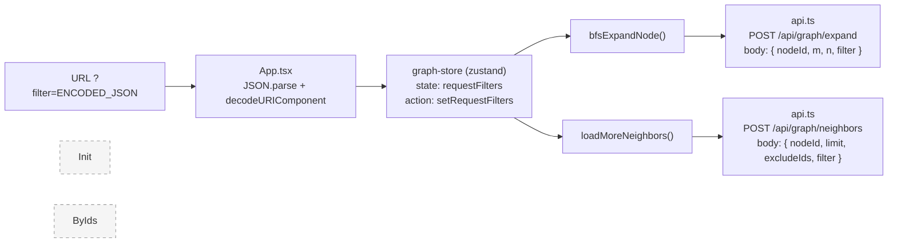

## 需求概述

将前端 URL 中筛选条件的传入方式重构为 "URL 播种（Seed） + 前端状态托管（State） + POST Body 传输" 三层架构。

### URL 约定

单参数 `filter` + 编码后的 JSON 字符串：

```
DeepScope/?filter=%7B%22project%22%3A%22aaa%22%7D
```

解码后等价于 `filter={"project":"aaa"}`。类型筛选也统一纳入：`filter={"project":"aaa","type":"项目"}`。

### 三层架构

1. **URL（播种）**：仅在页面首次刷新/分享时作为初始筛选条件的载体
2. **前端状态（复用）**：页面加载后立即将 URL 中的 JSON 解析出来存入 zustand store，后续所有 API 调用复用
3. **请求体（传输）**：所有发给后端的请求统一使用 POST + Request Body 传递筛选条件

### 核心功能

- 从 URL `?filter=ENCODED_JSON` 解析筛选条件，失败时仅 warning 不阻断
- 筛选条件存入 zustand 全局状态（graph-store）的 `requestFilters` 字段
- 删除 api.ts 中的模块级 `_filters` 变量 + `setRequestFilters`/`getRequestFilters`
- 仅 `expandGraph` 和 `fetchNeighbors` 新增可选 `filters?: Record<string, unknown>` 参数，放入 POST body 的 `filter` 字段
- `fetchInitialGraph` 和 `fetchNodesByIds` **不涉及**，保持 GET 不变，无 filter
- `bfsExpandNode` 和 `loadMoreNeighbors` 从 store 读取 `requestFilters` 传入 API
- App.tsx 只在 config 加载阶段解析 URL 存入 store，初始加载路径不涉及 filter

## 技术方案

### 技术栈

- 前端框架：React 18 + TypeScript
- 状态管理：Zustand（已有）
- HTTP 请求：Axios（已有）

### 实施策略

**数据流**：

```
URL ?filter={"project":"aaa"}
        | 首次加载解析
App.tsx --> useGraphStore.getState().setRequestFilters({project:"aaa"})
        | store 中持久化
graph-store.requestFilters = {project:"aaa"}
        | bfsExpandNode / loadMoreNeighbors 从 store 读取并传入
bfsExpandNode / loadMoreNeighbors
        |
api.ts expandGraph / fetchNeighbors --> POST body.filter = {project:"aaa"}
```

> `fetchInitialGraph` 和 `fetchNodesByIds` 不涉及 filter，保持现状。

### 关键设计决策

1. **显式参数传递而非隐式模块变量**：删除 api.ts 中的 `_filters` 模块级变量，改为 `expandGraph` 和 `fetchNeighbors` 显式接收 `filters` 参数。数据流更清晰，store 是单一事实来源。

2. **仅影响 POST 接口**：filter 只在 `expandGraph` 和 `fetchNeighbors` 的 POST body 中追加 `filter` 字段，不涉及 GET 接口的改造，最小化影响范围。

3. **filters 类型**：使用 `Record<string, unknown>`，不做值类型限制，以原始 JSON 对象的形式传给后端，后端自行解析。

4. **App.tsx 中 filters 获取方式**：使用 `useGraphStore.getState().requestFilters` 同步读取。由于 filter 解析在第一个 useEffect（config 加载阶段）完成，第二个 useEffect（初始数据加载）运行时 filters 已就绪，无需响应式订阅。

### 实施要点

- **性能**：filters 对象极小（几个 key），序列化开销可忽略
- **日志**：各 API 函数在附带 filters 时加 `console.log('[api] 请求携带 filters:', filters)`
- **向后兼容**：filters 为可选参数，不传时 body 中不加 `filter` 字段，行为与重构前一致
- **错误处理**：URL filter 参数 JSON 解析失败时 console.warning 不阻断
- **无多余改动**：仅修改 3 个文件，不涉及 graph-container.tsx、graph-toolbar.tsx 等其他组件

### 架构图



### 涉及文件

| 文件 | 操作 | 说明 |
| --- | --- | --- |
| `frontend/src/lib/api.ts` | 修改 | 删除模块级 _filters + 仅 expandGraph 和 fetchNeighbors 新增 filters 参数 |
| `frontend/src/lib/stores/graph-store.ts` | 修改 | 新增 requestFilters 状态/action + bfsExpandNode/loadMoreNeighbors 联动 |
| `frontend/src/App.tsx` | 修改 | URL 解析改为 ?filter=ENCODED_JSON 存入 store，初始加载不涉及 |