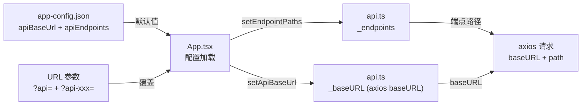

## 需求概述

重新设计前端 API URL 配置系统，让 API 基础地址和每个端点路径都可通过外部配置，不再在代码中硬编码。

### 核心变更

1. **URL 参数重设计**：`?api=http://server:9000` 替换基础地址（可带路径前缀），删除 `?api-path=`，新增每个独立端点的 URL 参数
2. **`app-config.json` 新增默认端点配置**：`apiEndpoints` 区块存放 5 个 API 的默认路径
3. **`api.ts` 去硬编码**：5 个请求函数的路经改为从可配置变量读取
4. **`API文档.md` 同步更新**：第 4 节 URL 参数全部重写

### URL 参数一览

| 参数 | 示例 | 说明 |
| --- | --- | --- |
| `?api=` | `http://localhost:8002` | 基础地址（可带路径前缀） |
| `?api-domains=` | `/v2/domains` | domains 端点路径覆盖 |
| `?api-initial=` | `/v2/graph/initial` | initial 端点路径覆盖 |
| `?api-expand=` | `/v2/graph/expand` | expand 端点路径覆盖 |
| `?api-neighbors=` | `/v2/graph/neighbors` | neighbors 端点路径覆盖 |
| `?api-nodes=` | `/v2/graph/nodes` | nodes 端点路径覆盖 |


例如 `?api=http://a.com:9000&api-expand=/v2/expand` 最终 expand 请求 = `http://a.com:9000/v2/expand`

### 优先级链

代码内默认路径 → app-config.json `apiEndpoints` → URL 参数 `?api-*=` → 最终拼接：`api(基础地址) + 端点路径`

## 技术方案

### 技术栈

当前项目技术栈不变：React + TypeScript + Vite + Tailwind CSS + shadcn/ui + Zustand + G6，axios 网络库

### 实现方案

#### api.ts 改动

- 新增 `_endpoints` 对象存储 5 个端点路径，初始值为代码内默认值
- 新增导出函数 `setEndpointPaths(paths: Record<string, string>)` 供外部批量修改（单参/多参均可）
- 5 个请求函数中将硬编码路径改为从 `_endpoints[name]` 读取

```typescript
const _endpoints: Record<string, string> = {
  domains: '/api/domains',
  initial: '/api/graph/initial',
  expand: '/api/graph/expand',
  neighbors: '/api/graph/neighbors',
  nodes: '/api/graph/nodes',
};

export function setEndpointPaths(paths: Record<string, string>) {
  Object.assign(_endpoints, paths);
}
```

每个请求函数示例：

```typescript
export async function fetchDomains(): Promise<DomainItem[]> {
  const { data } = await api.get(_endpoints.domains);
  return Array.isArray(data) ? data : [];
}
```

#### App.tsx 改动（第 28-100 行）

- `?api-base=` → `?api=`（第 41 行 `get('api-base')` → `get('api')`，变量名改 `apiBaseParam` → `apiParam`）
- 删除 `api-path` 相关逻辑三行（第 47-51 行）
- 在 config 加载完成后，依次：

1. 从 `cfg?.apiEndpoints` 读取默认端点路径，调用 `setEndpointPaths()`
2. 遍历端点名称列表，收集 URL 参数 `?api-{name}=`，统一调用一次 `setEndpointPaths()`

- 端点名称列表：`['domains', 'initial', 'expand', 'neighbors', 'nodes']`

#### app-config.json 改动

- 新增 `apiEndpoints` 字段，包含 5 个端点的默认路径

#### API文档.md 改动（第 348-401 行）

- 参数表中删除 `api-base` / `api-path` 两行
- 新增 `?api=` 行
- 新增 5 个 `?api-domains=` `?api-initial=` `?api-expand=` `?api-neighbors=` `?api-nodes=` 行
- 删除组合逻辑速查表（第 364-376 行）
- 更新 4.2 示例：删除 `api-base`/`api-path` 示例，新增 `?api=` + `?api-*=` 组合示例
- 更新 4.3 首屏加载流程中提及的接口路径引用

### 架构设计



### 目录结构

```
frontend/
├── public/
│   └── app-config.json        # [MODIFY] 新增 apiEndpoints 区块
├── src/
│   ├── App.tsx                # [MODIFY] ?api-base= → ?api=，删除 api-path，新增端点 URL 参数解析
│   └── lib/
│       └── api.ts             # [MODIFY] 移除硬编码路径，改为可配置变量 + setEndpointPaths
API文档.md                      # [MODIFY] 重写第 4 节 URL 参数
```

### 执行注意事项

- **向后兼容**：`?api-base=` 将不再识别，但 `?api=` 此前从未被用作 URL 参数，故无兼容问题
- **端点路径格式**：端点路径必须以 `/` 开头（由配置方保证），最终请求 URL = `_baseURL + _endpoints[name]`
- **axios interceptor 不变**：仍使用 `_baseURL` 设置 baseURL
- **无 linter 错误**：改完后需用 read_lints 验证